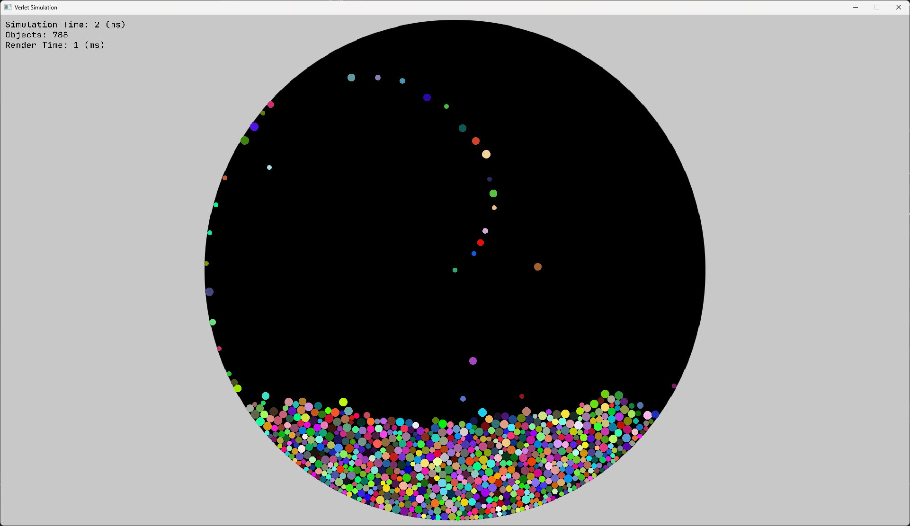

# VerletSDL


This is a simple physics engine written in SDL2 for practice.   
It was made by closely following this video by johnBuffer:  
[](https://youtu.be/lS_qeBy3aQI?si=xLSt6ibC06JEcnEY)

His repo can be found here: https://github.com/johnBuffer/VerletSFML

# Build
## Using Visual Studio
1. Clone this repo.
2. Open VarletSDL/ in Visual Studio and compile the Release version.


## Using MSVC
```
git clone https://github.com/donhn/VerletSDL
cd VerletSDL
mkdir build
cd build
cmake ..
cmake --build . --config Release
./Release/verlet-sdl.exe
```

## Using GCC and Ninja
```
git clone https://github.com/donhn/VerletSDL
cd VerletSDL
mkdir build
cd build
cmake -GNinja ..
cmake --build .
./bin/verlet-sim.exe
```
